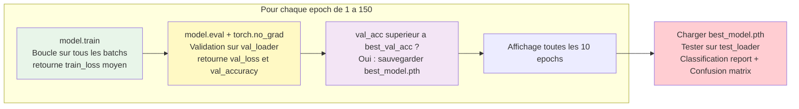

# Architecture du modele et boucle d'entrainement

## 1. Architecture du Conv1DClassifier

> Input : signal 1D de particule (1 canal, 250 echantillons apres decimation x4)

```mermaid
graph TD
    INPUT["Input<br/>(batch, 1, 250)"]

    subgraph BLOC1["Bloc Conv 1"]
        CONV1["Conv1d<br/>in=1, out=64, kernel=5, pad=2<br/>Params: 384"]
        BN1["BatchNorm1d(64)<br/>Params: 128"]
        RELU1["ReLU"]
        POOL1["MaxPool1d(2)<br/>(batch, 64, 125)"]
        DROP1["Dropout(0.2)"]
    end

    subgraph BLOC2["Bloc Conv 2"]
        CONV2["Conv1d<br/>in=64, out=128, kernel=5, pad=2<br/>Params: 41 088"]
        BN2["BatchNorm1d(128)<br/>Params: 256"]
        RELU2["ReLU"]
        POOL2["MaxPool1d(2)<br/>(batch, 128, 62)"]
        DROP2["Dropout(0.2)"]
    end

    subgraph BLOC3["Bloc Conv 3"]
        CONV3["Conv1d<br/>in=128, out=256, kernel=5, pad=2<br/>Params: 164 096"]
        BN3["BatchNorm1d(256)<br/>Params: 512"]
        RELU3["ReLU"]
        POOL3["MaxPool1d(2)<br/>(batch, 256, 31)"]
        DROP3["Dropout(0.2)"]
    end

    subgraph MLP["Tete de classification MLP"]
        FLAT["Flatten<br/>(batch, 7936)"]
        FC1["Linear(7936, 256)<br/>Params: 2 031 872"]
        RELU_FC["ReLU"]
        DROP_FC["Dropout(0.5)"]
        FC2["Linear(256, 3)<br/>Params: 771"]
    end

    OUTPUT["Output logits<br/>(batch, 3)<br/>Classes: 2um, 4um, 10um"]

    INPUT --> CONV1 --> BN1 --> RELU1 --> POOL1 --> DROP1
    DROP1 --> CONV2 --> BN2 --> RELU2 --> POOL2 --> DROP2
    DROP2 --> CONV3 --> BN3 --> RELU3 --> POOL3 --> DROP3
    DROP3 --> FLAT --> FC1 --> RELU_FC --> DROP_FC --> FC2
    FC2 --> OUTPUT

    style INPUT fill:#e1f5fe
    style OUTPUT fill:#e8f5e9
    style BLOC1 fill:#fff3e0
    style BLOC2 fill:#fff3e0
    style BLOC3 fill:#fff3e0
    style MLP fill:#f3e5f5
```

**Total parametres entrainables : ~2 239 107**

| Couche | Parametres |
|--------|-----------|
| Conv1 + BN1 | 512 |
| Conv2 + BN2 | 41 344 |
| Conv3 + BN3 | 164 608 |
| FC1 | 2 031 872 |
| FC2 | 771 |
| **Total** | **~2 239 107** |

> 90% des parametres sont dans la couche FC1 (passage de 7936 vers 256).

---

## 2. Boucle d'entrainement — une iteration (un batch)

```mermaid
graph TD
    START["Debut de l iteration<br/>Charger un batch signals et labels"]
    TO_DEVICE["Transfert vers device<br/>signals.to device - labels.to device"]
    ZERO_GRAD["optimizer.zero_grad<br/>Reinitialiser les gradients a zero"]

    subgraph FORWARD["Forward pass"]
        FWD1["signals passe dans le modele<br/>outputs = model signals"]
        FWD2["Conv1 - BN1 - ReLU - Pool - Dropout<br/>Conv2 - BN2 - ReLU - Pool - Dropout<br/>Conv3 - BN3 - ReLU - Pool - Dropout<br/>Flatten - FC1 - ReLU - Dropout - FC2"]
        FWD3["Sortie : logits de forme batch x 3"]
    end

    subgraph LOSS_CALC["Calcul de la loss"]
        LOSS["loss = CrossEntropyLoss outputs labels<br/>1. Softmax sur les logits<br/>2. Log-vraisemblance negative<br/>3. Moyenne sur le batch"]
    end

    subgraph BACKWARD["Backpropagation"]
        BACK1["loss.backward<br/>Calcul des gradients dL/dw<br/>pour chaque parametre w"]
        BACK2["Parcours du graphe de calcul<br/>en sens inverse :<br/>FC2 - FC1 - Conv3 - Conv2 - Conv1"]
        BACK3["Chaque parametre accumule<br/>son gradient dans .grad"]
    end

    subgraph UPDATE["Mise a jour des poids"]
        OPT["optimizer.step<br/>Adam : w = w - lr * m / sqrt v + eps<br/>avec weight_decay=0.0001"]
    end

    ACCUM["Accumuler la loss pour le reporting<br/>total_loss += loss.item * batch_size"]
    NEXT["Batch suivant ou fin de epoch"]

    START --> TO_DEVICE --> ZERO_GRAD
    ZERO_GRAD --> FWD1 --> FWD2 --> FWD3
    FWD3 --> LOSS
    LOSS --> BACK1 --> BACK2 --> BACK3
    BACK3 --> OPT
    OPT --> ACCUM --> NEXT

    style START fill:#e1f5fe
    style FORWARD fill:#e8f5e9
    style LOSS_CALC fill:#fff9c4
    style BACKWARD fill:#ffcdd2
    style UPDATE fill:#f3e5f5
    style NEXT fill:#e1f5fe
```

### Cycle complet d une epoch

