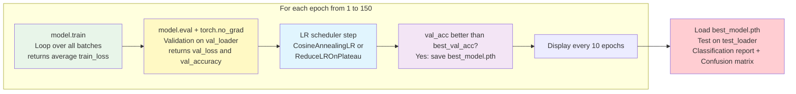

# Model Architecture and Training Loop

## 1. Model Zoo Overview

The project includes a **model zoo** of 8 architectures in `models/`, all adapted for 1D particle signal classification. Every model follows the same interface:

```python
from models import create_model, list_models

model = create_model("ResNet1D", input_length=625, num_classes=4)
output = model(x)  # x: (batch, 1, input_length) -> (batch, num_classes)
```

All models expose a `feature_layer` attribute (penultimate `nn.Linear`, always 256-dim output) for hook-based feature extraction used in OOD evaluation and cluster distance analysis.

### Available Models

| Model | Registry Key | File | Params (4-class, 625) | Architecture |
|-------|-------------|------|----------------------:|--------------|
| Conv1D | `Conv1D` | `models/conv1d.py` | 5,319,556 | 3 Conv+BN+Pool blocks, 2 FC layers |
| LeNet-5 | `LeNet1D` | `models/lenet1d.py` | 5,255,364 | 2 Conv+BN+Pool layers, 3 FC layers |
| VGG | `VGG1D` | `models/vgg1d.py` | 5,270,996 | 4 VGG blocks (stacked 3-kernel convs), 3 FC layers |
| ResNet-18 | `ResNet1D` | `models/resnet1d.py` | 5,289,990 | Stem + 4 residual stages (BasicBlock), GAP, 2 FC layers |
| InceptionTime | `InceptionTime1D` | `models/inception1d.py` | 5,289,832 | 6 Inception modules (multi-scale parallel convs), residual shortcuts every 3, GAP |
| MobileNetV2 | `MobileNet1D` | `models/mobilenet1d.py` | 5,364,292 | Depthwise separable convs, inverted residual blocks, ReLU6, GAP |
| EfficientNet-B0 | `EfficientNet1D` | `models/efficientnet1d.py` | 5,393,462 | MBConv blocks, squeeze-and-excitation, SiLU, stochastic depth, GAP |
| DenseNet | `DenseNet1D` | `models/densenet1d.py` | 5,298,364 | 3 dense blocks (6/12/24 layers), transition layers, growth_rate=40, GAP |

> All models are scaled to ~5.3M parameters for fair comparison. Feature layer output is always 256-dim.

### Model-Specific Parameters

Each model accepts `input_length`, `num_classes`, and `dropout` as standard arguments. Additional architecture-specific parameters:

| Model | Extra Parameters |
|-------|-----------------|
| Conv1D | _(none)_ |
| LeNet1D | _(none)_ |
| VGG1D | _(none)_ |
| ResNet1D | `base_width=74` |
| InceptionTime1D | `num_filters=148`, `depth=6`, `bottleneck_size=64` |
| MobileNet1D | `width_mult=1.5` |
| EfficientNet1D | `width_mult=0.85` |
| DenseNet1D | `growth_rate=40`, `block_config=(6,12,24)`, `init_channels=64`, `compression=0.5`, `bn_size=4` |

### Code Organization

```
models/
  __init__.py          # MODEL_REGISTRY + create_model() + list_models()
  conv1d.py            # Conv1DClassifier
  lenet1d.py           # LeNet1D
  vgg1d.py             # VGG1D
  resnet1d.py          # ResNet1D
  inception1d.py       # InceptionTime1D
  mobilenet1d.py       # MobileNet1D
  efficientnet1d.py    # EfficientNet1D
  densenet1d.py        # DenseNet1D
```

### Feature Extraction Interface

All models expose `model.feature_layer` for hook-based feature extraction:

```python
activations = []
def hook_fn(m, inp, out):
    activations.append(out.detach().cpu())

hook = model.feature_layer.register_forward_hook(hook_fn)
model(x)
hook.remove()
features = torch.cat(activations, dim=0).numpy()  # shape: (N, 256)
```

This is used by `train4classes.py` for latent space visualization, OOD evaluation (Mahalanobis, silhouette score), and cluster distance analysis.

---

## 2. Conv1DClassifier Architecture (detailed)

> Input: 1D particle signal (1 channel, 250 samples after 4x decimation)

```mermaid
graph TD
    INPUT["Input<br/>(batch, 1, 250)"]

    subgraph BLOC1["Conv Block 1"]
        CONV1["Conv1d<br/>in=1, out=64, kernel=5, pad=2<br/>Params: 384"]
        BN1["BatchNorm1d(64)<br/>Params: 128"]
        RELU1["ReLU"]
        POOL1["MaxPool1d(2)<br/>(batch, 64, 125)"]
        DROP1["Dropout(0.2)"]
    end

    subgraph BLOC2["Conv Block 2"]
        CONV2["Conv1d<br/>in=64, out=128, kernel=5, pad=2<br/>Params: 41 088"]
        BN2["BatchNorm1d(128)<br/>Params: 256"]
        RELU2["ReLU"]
        POOL2["MaxPool1d(2)<br/>(batch, 128, 62)"]
        DROP2["Dropout(0.2)"]
    end

    subgraph BLOC3["Conv Block 3"]
        CONV3["Conv1d<br/>in=128, out=256, kernel=5, pad=2<br/>Params: 164 096"]
        BN3["BatchNorm1d(256)<br/>Params: 512"]
        RELU3["ReLU"]
        POOL3["MaxPool1d(2)<br/>(batch, 256, 31)"]
        DROP3["Dropout(0.2)"]
    end

    subgraph MLP["Classification Head (MLP)"]
        FLAT["Flatten<br/>(batch, 7936)"]
        FC1["Linear(7936, 256)<br/>Params: 2 031 872"]
        RELU_FC["ReLU"]
        DROP_FC["Dropout(0.5)"]
        FC2["Linear(256, 3)<br/>Params: 771"]
    end

    OUTPUT["Output logits<br/>(batch, 3)<br/>Classes: 2um, 4um, 10um"]

    INPUT --> CONV1 --> BN1 --> RELU1 --> POOL1 --> DROP1
    DROP1 --> CONV2 --> BN2 --> RELU2 --> POOL2 --> DROP2
    DROP2 --> CONV3 --> BN3 --> RELU3 --> POOL3 --> DROP3
    DROP3 --> FLAT --> FC1 --> RELU_FC --> DROP_FC --> FC2
    FC2 --> OUTPUT

    style INPUT fill:#e1f5fe
    style OUTPUT fill:#e8f5e9
    style BLOC1 fill:#fff3e0
    style BLOC2 fill:#fff3e0
    style BLOC3 fill:#fff3e0
    style MLP fill:#f3e5f5
```



**Total trainable parameters: ~2 239 107**

| Layer | Parameters |
|-------|-----------|
| Conv1 + BN1 | 512 |
| Conv2 + BN2 | 41 344 |
| Conv3 + BN3 | 164 608 |
| FC1 | 2 031 872 |
| FC2 | 771 |
| **Total** | **~2 239 107** |

> 90% of parameters are in the FC1 layer (7936 to 256 projection).

---

## 3. Training Pipelines

The project has two training scripts:

| Script | Classes | Models | OOD | Cluster Distances | W&B | Augmentation | Optimizer |
|--------|---------|--------|-----|-------------------|-----|-------------|-----------|
| `train.py` | 3 (2um, 4um, 10um) | Conv1D only | No | No | No | No | Adam |
| `train4classes.py` | 4 (2um, 4um, 10um, Noise) | All 8 models | Yes (5 methods, via `--noise-dir`) | Yes (via `--noise-dir`) | Yes | Yes (`--augment`) | Adam/AdamW/SGD (`--optimizer`) |

`train4classes.py` is the unified pipeline supporting the full model zoo with optional OOD evaluation, cluster distance analysis, data augmentation, and optimizer selection. See the README for usage examples.

> Legacy scripts (`benchmark.py`, `compute_cluster_distances.py`) have been moved to `archive/`.

---

## 4. Training Loop — One Iteration (One Batch)

```mermaid
graph TD
    START["Start of iteration<br/>Load a batch of signals and labels"]
    TO_DEVICE["Transfer to device<br/>signals.to device - labels.to device"]
    ZERO_GRAD["optimizer.zero_grad<br/>Reset gradients to zero"]

    subgraph FORWARD["Forward pass"]
        FWD1["Pass signals through the model<br/>outputs = model signals"]
        FWD2["Conv1 - BN1 - ReLU - Pool - Dropout<br/>Conv2 - BN2 - ReLU - Pool - Dropout<br/>Conv3 - BN3 - ReLU - Pool - Dropout<br/>Flatten - FC1 - ReLU - Dropout - FC2"]
        FWD3["Output: logits of shape batch x 3"]
    end

    subgraph LOSS_CALC["Loss computation"]
        LOSS["loss = CrossEntropyLoss outputs labels<br/>1. Softmax on logits<br/>2. Negative log-likelihood<br/>3. Average over batch"]
    end

    subgraph BACKWARD["Backpropagation"]
        BACK1["loss.backward<br/>Compute gradients dL/dw<br/>for each parameter w"]
        BACK2["Traverse the computation graph<br/>in reverse order:<br/>FC2 - FC1 - Conv3 - Conv2 - Conv1"]
        BACK3["Each parameter accumulates<br/>its gradient in .grad"]
    end

    subgraph UPDATE["Weight update"]
        OPT["optimizer.step<br/>Adam/AdamW/SGD<br/>with configurable weight_decay"]
    end

    ACCUM["Accumulate loss for reporting<br/>total_loss += loss.item * batch_size"]
    NEXT["Next batch or end of epoch"]

    START --> TO_DEVICE --> ZERO_GRAD
    ZERO_GRAD --> FWD1 --> FWD2 --> FWD3
    FWD3 --> LOSS
    LOSS --> BACK1 --> BACK2 --> BACK3
    BACK3 --> OPT
    OPT --> ACCUM --> NEXT

    style START fill:#e1f5fe
    style FORWARD fill:#e8f5e9
    style LOSS_CALC fill:#fff9c4
    style BACKWARD fill:#ffcdd2
    style UPDATE fill:#f3e5f5
    style NEXT fill:#e1f5fe
```



### Complete Epoch Cycle


