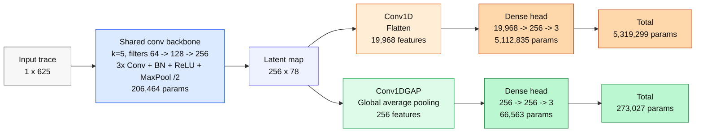
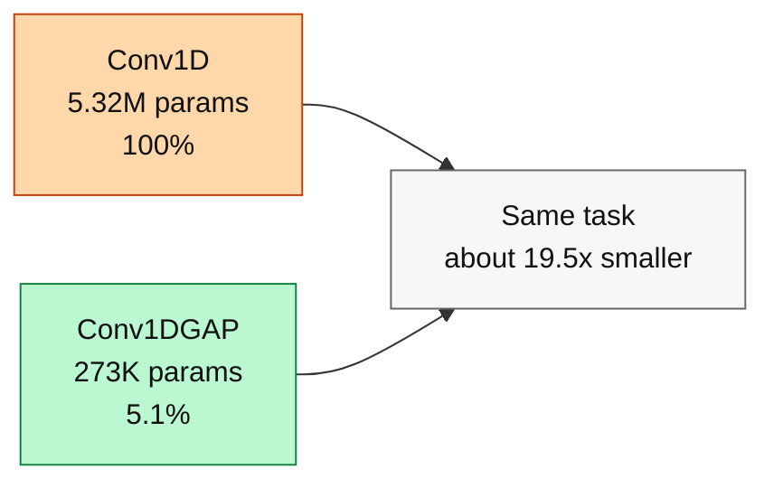
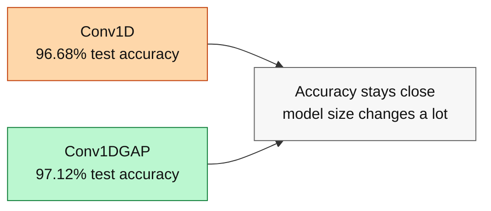

# Conv1D vs Conv1DGAP

Comparison on Benchmark 2, Tier 1 standard laser dataset.

Context: input trace `1 x 625`, `3` output classes, base `M` variants with
`width_mult = 1.0`, averaged over 3 seeds.

---

## Architecture 1v1

Reading the diagram:

- Blue is shared by both models.
- Orange is the expensive `Flatten` path.
- Green is the compact `Global Average Pooling` path.

**Main difference.** `Conv1DGAP` keeps the same convolutional feature extractor
but replaces `Flatten(256 x 78)` with global average pooling. The dense head
shrinks from `5.11M` parameters to `66.6K`, reducing the full model by about
`19.5x`.

### Parameter Footprint

---

## Accuracy 1v1

### Test Accuracy

| Model | Test accuracy | Std | Seeds |
|---|---:|---:|---:|
| Conv1D | 96.68% | 0.33% | 3 |
| Conv1DGAP | 97.12% | 1.02% | 3 |

### Validation Accuracy

| Model | Best val accuracy | Seeds |
|---|---:|---:|
| Conv1D | 98.75% | 3 |
| Conv1DGAP | 98.46% | 3 |

**Takeaway.** On the base laser classification task, `Conv1DGAP` matches or
slightly improves mean test accuracy while using only about `5.1%` of the
parameters of `Conv1D`.

---

## Sources

- Architectures: `models/conv1d.py`, `models/conv1d_gap.py`
- Test accuracy and parameter counts: `outputs/benchmarks/results/benchmark2/summary.csv`
- Validation accuracy: `outputs/benchmarks/results/benchmark2/runs/*-dataset-tier1-seed*.json`
