# Model Zoo — Architecture Diagrams

All 10 models take a 1D signal `(batch, 1, L)` and output class logits `(batch, C)`.

**Legend.** Edge labels show the tensor shape `channels×length` at each step. Signature blocks are highlighted in the family colour.

---

## 1. Conv1D

Plain CNN — 3 conv blocks, flatten, FC head.

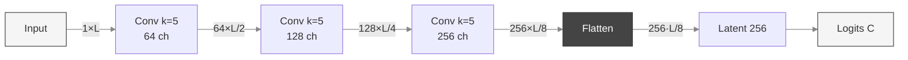

> Block = Conv1d + BN + ReLU + MaxPool(/2) + Dropout. **Flatten** couples head size to L.

---

## 2. Conv1DGAP

Same backbone as Conv1D but **Global Average Pooling** replaces flatten → input-length agnostic, much smaller head.

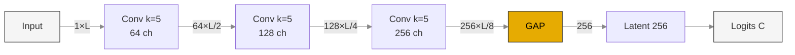

> **GAP** = AdaptiveAvgPool1d(1) — collapses the temporal axis to 1, regardless of L.

---

## 3. LeNet1D

Classic LeNet-5 adapted to 1D — 2 conv stages, heavy FC head.

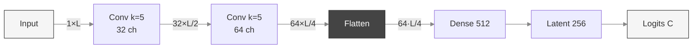

> Minimal backbone, heavy FC head — parameter count scales with L.

---

## 4. VGG1D

Stacked small (k=3) convolutions, doubling channels — 4 blocks.

```mermaid
graph LR
    A["Input"] -->|"1×L"| B["2× Conv k=3\n64 ch"]
    B -->|"64×L/2"| C["2× Conv k=3\n128 ch"]
    C -->|"128×L/4"| D["3× Conv k=3\n256 ch"]
    D -->|"256×L/8"| E["3× Conv k=3\n256 ch"]
    E -->|"256×L/16"| F["Flatten"]
    F -->|"256·L/16"| G["Dense 400"]
    G --> H["Latent 256"]
    H --> I["Logits C"]

    style A fill:#f5f5f5,stroke:#333
    style I fill:#f5f5f5,stroke:#333
    style F fill:#444,stroke:#333,color:#fff
    linkStyle default stroke:#888
```

> Block = N × (Conv + BN + ReLU) + MaxPool(/2). Heavy flatten → large FC.

---

## 5. ResNet1D

Residual blocks with **skip connections** — ResNet-18 style. Width `w` = `base_width` (default 74).

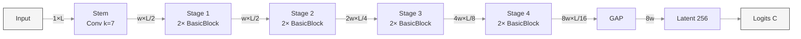

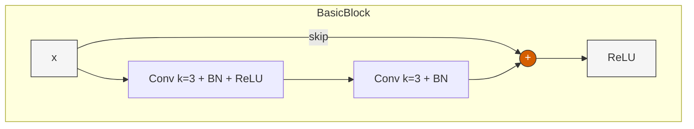

> Stage 2+ doubles channels and halves length via strided first block. Identity skip when shapes match, else 1×1 projection.

---

## 6. InceptionTime1D

**Multi-scale parallel convolutions** — 6 modules, residual shortcut every 3.

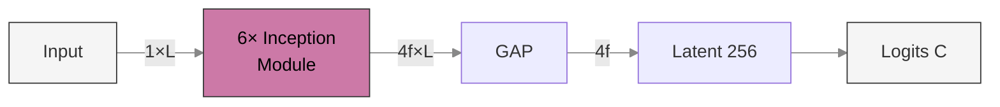

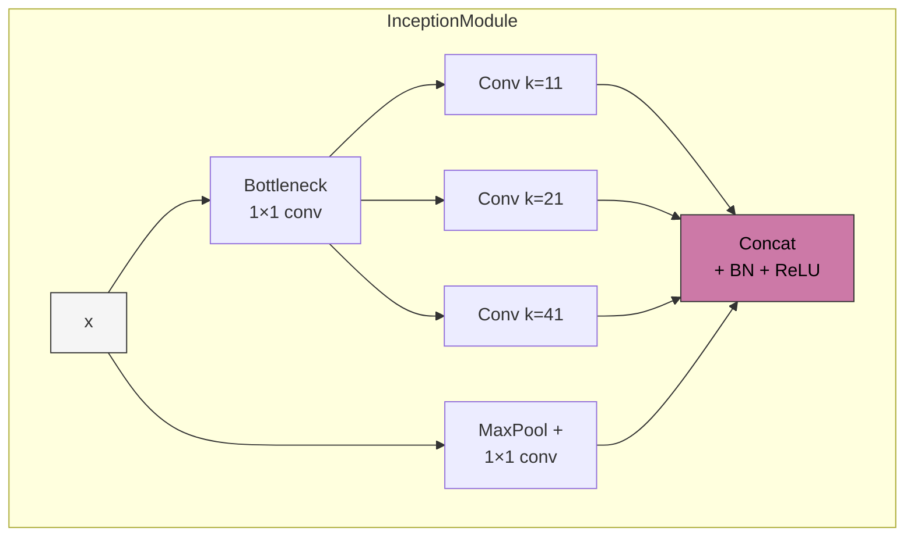

> Length preserved inside the module; output = concat of 4 parallel branches (→ 4f channels). `f` = `num_filters` (default 148).

---

## 7. MobileNet1D

**Depthwise separable convolutions** with inverted residual bottleneck (MobileNetV2).

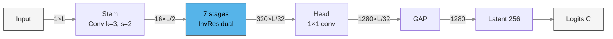

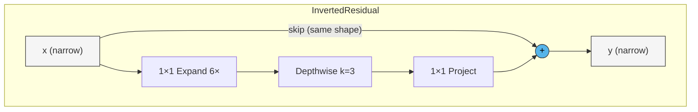

> ReLU6 activations. Linear bottleneck (no activation after project). Skip only when input/output shapes match.

---

## 8. EfficientNet1D

Like MobileNet but adds **Squeeze-and-Excitation** + **stochastic depth** (EfficientNet-B0 style).

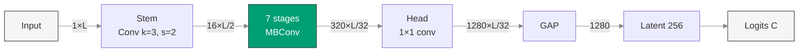

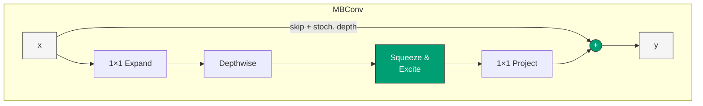

> SiLU activations. SE recalibrates channel importance. Stochastic depth drops entire blocks during training.

---

## 9. DenseNet1D

**Dense connectivity** — each layer receives all preceding feature maps via concatenation.

```mermaid
graph LR
    A["Input"] -->|"1×L"| S["Stem\nConv k=7 + MaxPool"]
    S -->|"c0×L/4"| D1["Dense Block\n6 layers"]
    D1 -->|"+6g"| T1["Transition /2"]
    T1 --> D2["Dense Block\n12 layers"]
    D2 -->|"+12g"| T2["Transition /2"]
    T2 --> D3["Dense Block\n24 layers"]
    D3 -->|"c×L/16"| G["GAP"]
    G --> FC["Latent 256"]
    FC --> O["Logits C"]

    style A fill:#f5f5f5,stroke:#333
    style O fill:#f5f5f5,stroke:#333
    style D1 fill:#999,stroke:#333,color:#fff
    style D2 fill:#999,stroke:#333,color:#fff
    style D3 fill:#999,stroke:#333,color:#fff
    linkStyle default stroke:#888
```

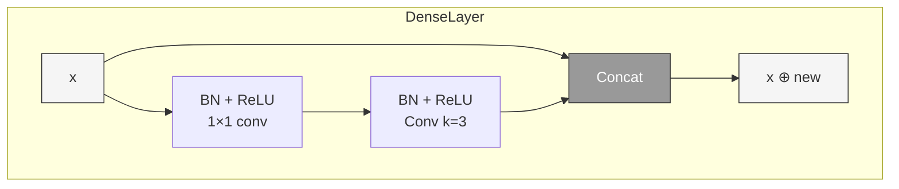

> Growth rate `g` = new channels per layer. Transition = BN + 1×1 conv + AvgPool (halves channels + length).

---

## 10. ConvNeXt1D

**Modernised CNN** inspired by Transformers — patchify stem, large-kernel DWConv, inverted bottleneck MLP, LayerNorm + GELU, layer scale.

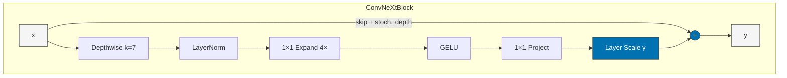

> Depths [3, 3, 9, 3] (ConvNeXt-Tiny). Channels double per stage: [d, 2d, 4d, 8d], with d = `base_dim` (default 42). Per-channel layer scale γ (init 1e-6) stabilises training.

---

## Quick Comparison

| Model | Key Idea | Conv backbone | Classifier head | Head params (→ Latent 256) |
|---|---|---|---|---|
| **Conv1D** | Plain CNN | 3 × Conv k=5, 64→256 ch | Flatten(256·L/8) → 256 → C | 8192·L |
| **Conv1DGAP** | Plain CNN + GAP | 3 × Conv k=5, 64→256 ch | GAP(256) → 256 → C | 66k |
| **LeNet1D** | Minimal (LeNet-5) | 2 × Conv k=5, 32→64 ch | Flatten(64·L/4) → 512 → 256 → C | 8192·L + 132k |
| **VGG1D** | Stacked k=3 | 10 Conv k=3 (4 blocks), 64→256 ch | Flatten(256·L/16) → 400 → 256 → C | 6400·L + 103k |
| **ResNet1D** | Skip connections | 8 blocks × k=3, w→8w ch | GAP(8w) → 256 → C | 2048·w |
| **InceptionTime1D** | Multi-scale parallel | 6 modules × (k=11,21,41), 4f ch | GAP(4f) → 256 → C | 1024·f |
| **MobileNet1D** | Depthwise separable | 17 InvRes blocks, 16→320 ch | GAP(1280) → 256 → C | 328k |
| **EfficientNet1D** | MBConv + SE | 16 MBConv blocks, 16→320 ch | GAP(1280) → 256 → C | 328k |
| **DenseNet1D** | Dense concat | 42 layers (3 blocks), +g ch/layer | GAP(ch) → 256 → C | 256·ch_final |
| **ConvNeXt1D** | Modernised CNN (DWConv k=7 + MLP) | 18 blocks (4 stages [3,3,9,3]), d→8d ch | GAP(8d) → 256 → C | 2048·d |

> **Flatten-based heads** (Conv1D, LeNet, VGG) have parameter counts that scale with input length L, while **GAP-based heads** are L-agnostic.
