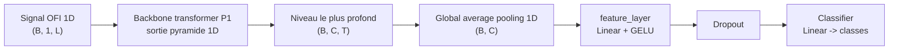
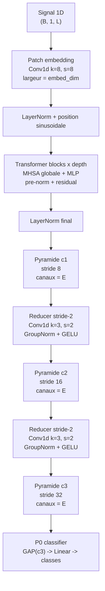
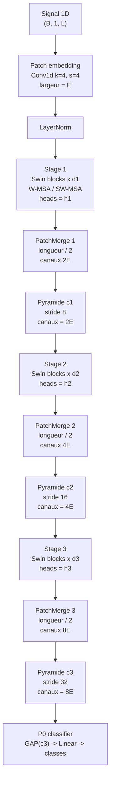

# Architecture et scaling des transformers 1D

Ce document resume les deux familles transformer ajoutees au zoo P0:
`PatchTST` et `Swin1D`. Dans P0, elles sont utilisees comme classifieurs:
le backbone vient de P1, puis P0 applique un global pooling sur le niveau le
plus profond, une couche cachee et une tete de classification.

Les valeurs du tableau viennent de
`outputs/benchmarks/results/benchmark2/summary.csv`, Tier 1, CPU torch,
batch = 1.

## Vue commune dans P0

La difference importante est dans le backbone: PatchTST est non
hierarchique au depart, alors que Swin-1D construit directement une pyramide
hierarchique.

## PatchTST

PatchTST transforme le signal en une sequence de patches, applique une pile de
blocs transformer globaux, puis fabrique une pyramide par deux reductions
stride-2. Les trois niveaux ont la meme largeur de canaux avant projection.

Scaling PatchTST:

- `embed_dim` augmente la largeur des tokens et domine le cout des blocs.
- `depth` augmente le nombre de blocs transformer empiles.
- `num_heads` suit la largeur pour garder une attention divisible et stable.
- `proj_channels` et `hidden_dim` augmentent la largeur vue par les tetes aval.
- La geometrie reste fixe: patch size 8, puis niveaux de stride 8, 16, 32.

## Swin-1D

Swin-1D utilise une attention locale par fenetres, avec fenetres decalees un
bloc sur deux pour faire communiquer les frontieres de fenetres. La pyramide
est hierarchique: chaque `PatchMerge` divise la longueur par deux et double la
largeur.

Dans chaque bloc Swin:

Scaling Swin-1D:

- `embed_dim` fixe la largeur initiale `E`; les stages sortent ensuite en
  `2E`, `4E`, `8E`.
- `depths = (d1, d2, d3)` controle le nombre de blocs par stage.
- `num_heads = (h1, h2, h3)` augmente avec la largeur des stages.
- `drop_path_rate` augmente avec la taille pour regulariser les modeles larges.
- La geometrie reste fixe: patch size 4, puis niveaux de stride 8, 16, 32.

## Tableau de scaling

| Modele | Famille | Taille | Params | MACs | Taille (MB) | Latence CPU mediane (ms) | Accuracy Tier 1 |
|---|---|---:|---:|---:|---:|---:|---:|
| PatchTST-Nano | PatchTST | Nano | 43,043 | 1,823,936 | 0.19 | 0.3589 | 0.9756 |
| PatchTST-XXS | PatchTST | XXS | 120,355 | 5,508,288 | 0.50 | 0.6028 | 0.9801 |
| PatchTST-XS | PatchTST | XS | 263,747 | 12,323,104 | 1.08 | 0.9085 | 0.9778 |
| PatchTST-S | PatchTST | S | 697,859 | 33,354,624 | 2.82 | 1.5943 | 0.9756 |
| PatchTST | PatchTST | M | 1,423,491 | 69,403,008 | 5.73 | 2.6245 | 0.9668 |
| PatchTST-L | PatchTST | L | 4,081,731 | 201,923,136 | 16.37 | 6.6151 | 0.9613 |
| Swin1D-Nano | Swin1D | Nano | 107,548 | 4,679,360 | 0.46 | 0.5278 | 0.9668 |
| Swin1D-XXS | Swin1D | XXS | 348,504 | 15,117,504 | 1.44 | 0.9584 | 0.9568 |
| Swin1D-XS | Swin1D | XS | 668,374 | 30,696,736 | 2.72 | 1.7946 | 0.9657 |
| Swin1D-S | Swin1D | S | 1,522,647 | 73,249,152 | 6.15 | 29.6600 | 0.9668 |
| Swin1D | Swin1D | M | 2,689,191 | 129,982,848 | 10.81 | 3.4798 | 0.9690 |
| Swin1D-L | Swin1D | L | 8,257,767 | 401,308,224 | 33.10 | 9.2818 | 0.9657 |

## A retenir pour la presentation

- Les deux familles atteignent la meme interface P0: un backbone pyramidal,
  puis un pooling global et une tete de classification.
- PatchTST est plus simple a expliquer: tokenisation en patches, attention
  globale, puis reducers pour obtenir une pyramide.
- Swin-1D est plus structure: attention locale en fenetres, fenetres decalees,
  et patch merging hierarchique.
- Le scaling augmente rapidement les parametres et les MACs, surtout pour les
  variantes larges.
- Sur Tier 1, les accuracies restent dans une bande tres serree. C'est utile
  pour tes slides: quand les transformers apparaissent sur les graphes, ils ne
  changent pas fortement la lecture visuelle du Pareto.

